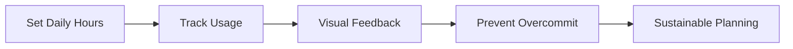
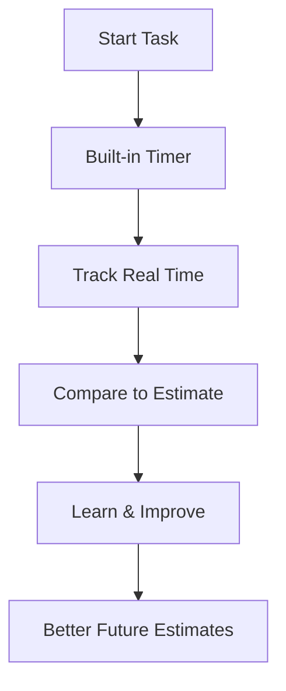
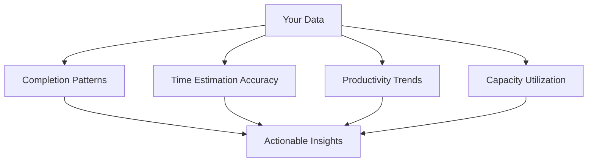
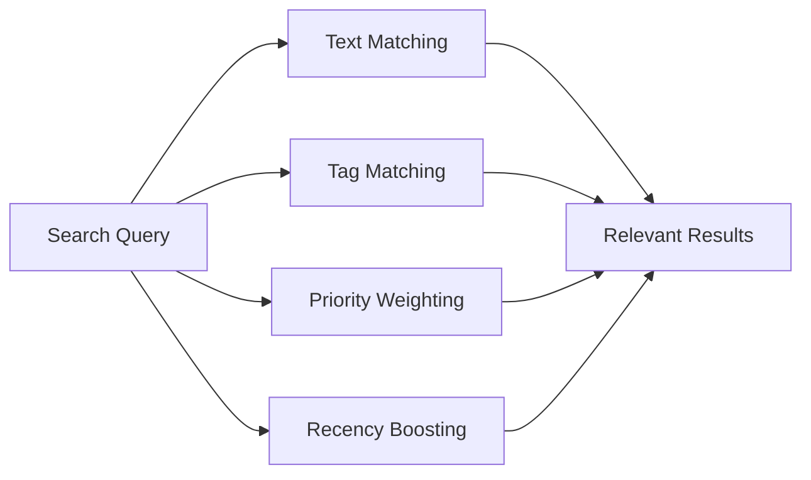
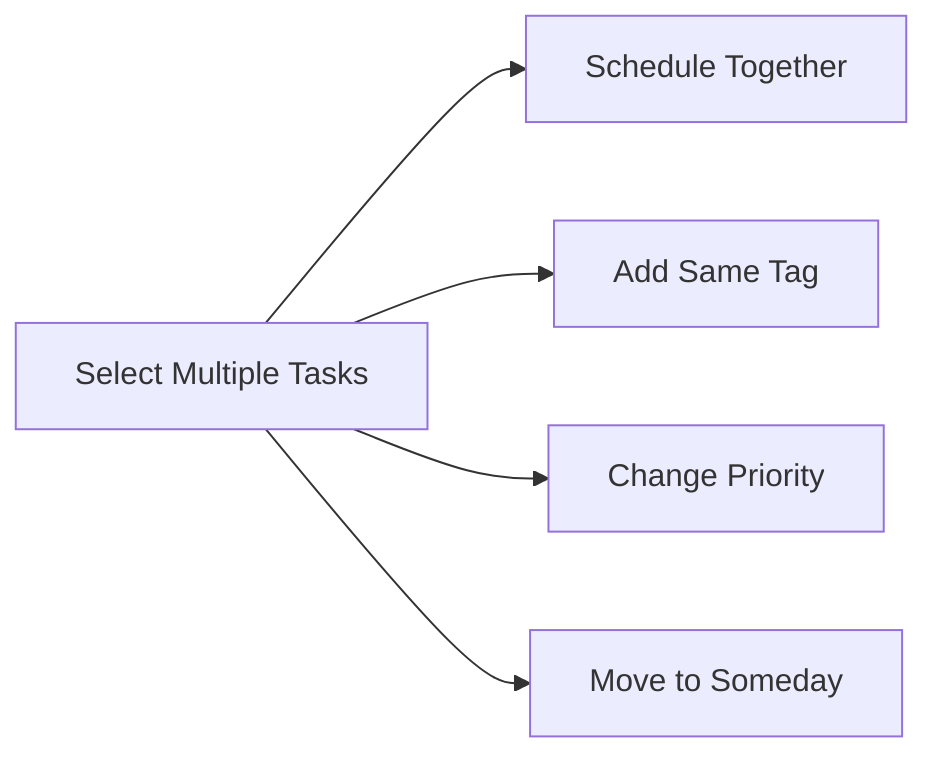
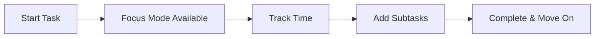
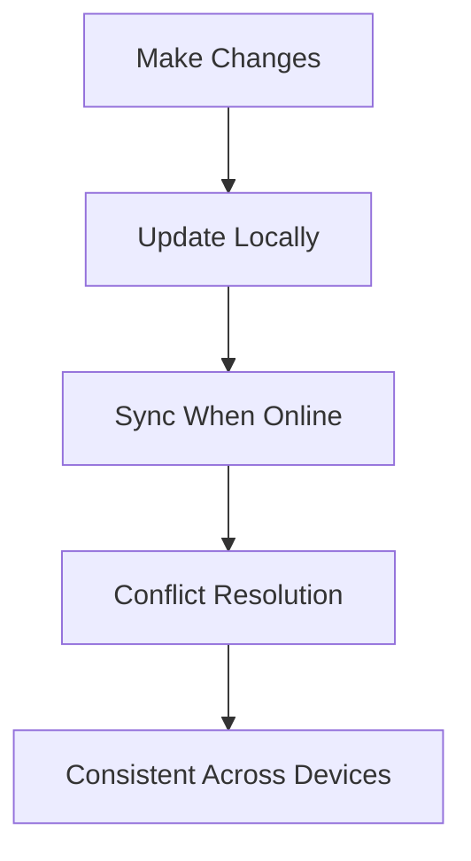

A proper tour of what's in RightNow and why each piece exists: the philosophy as much as the functionality.

## 🎯 The Capacity System

The capacity bar is the core constraint that makes everything else work.

### How It Works

1. **Set Your Reality**: Start with your actual available hours (not wishful thinking)
2. **Real-Time Tracking**: See capacity fill up as you add tasks
3. **Visual Warnings**: Red zones when you're approaching limits
4. **Smart Suggestions**: "You have 2 hours left - perfect for these tasks"

### The Psychology Behind It

Traditional apps let you add infinite tasks. RightNow says "Hold on - you only have 6 hours today. Choose wisely." This constraint forces better decision-making.

**Example Day:**
- 8 hours at work
- 2 hours for meetings/breaks
- **6 hours capacity** for focused work
- Tasks must fit within this reality

## ⏱️ Time Tracking That Actually Helps

Most time tracking feels like surveillance. This is meant to feel like learning.

### Key Features

- **One-Tap Start**: No complex setup, just hit play
- **Automatic Learning**: App improves estimates based on your patterns
- **Flexible Tracking**: Pause, resume, or adjust as needed
- **Privacy First**: All data stays on your device

### What You Discover

The kind of thing this surfaces (speaking from experience): the emails you think take 5 minutes take 20, and writing takes far longer than you'd ever estimate. Uncomfortable, but exactly the feedback that makes next week's plan better.

## 🎮 Refinement Games: Making Planning Fun

The most unusual feature in RightNow: backlog upkeep as quick games rather than a chore.

### This or That

Two tasks, head to head: which would you rather get done? A few rounds of honest snap judgements and your backlog is ranked by what actually matters to you, not what you claimed mattered when you wrote it down.

### The Duration Game

One task at a time, one question: how long will this really take? Tap an estimate or split the task in two if it's clearly more than one sitting. Tasks still wearing the default estimate come up first. Those are the ones nobody ever thought about.

### Make It Doable

Vague tasks are where procrastination breeds. This drill shows you a task and asks: could you start this right now from the title alone? If not, sharpen it or break it down on the spot.

### Keep or Delete

The honesty drill. Old, stale tasks come up one at a time: keep it, shelve it for someday, or admit it's never happening and let it go.

### Why Games Work

1. **Removes Friction**: Fun beats tedious
2. **Builds Habits**: Streaks encourage consistency
3. **Reduces Overwhelm**: One task at a time
4. **Provides Closure**: Clear completion signals

## 📊 Analytics That Drive Action

Data without insight is just noise. RightNow's analytics tell you what to do next.

### The Dashboard

### Key Metrics

**Completion Rate**: How often you finish what you plan
- Target: 80% (not 100% - that's perfectionism)
- Insight: "Your Tuesday completion rate is 65% - consider lighter scheduling"

**Estimation Accuracy**: How close your estimates are to reality
- Target: Within 20% of actual time
- Insight: "You underestimate writing tasks by 40% on average"

**Capacity Utilization**: How much of your available time you actually use
- Target: 70-80% (buffer for unexpected tasks)
- Insight: "You're using 95% capacity - consider reducing by 1 hour"

**Peak Performance Times**: When you're most productive
- Insight: "You complete 60% more tasks between 9-11am"

### Personalized Recommendations

- "Add 15 minutes to your writing estimates"
- "Consider reducing capacity from 7 to 6 hours"
- "Your backlog could use a quick refinement session"

## 🔍 Smart Search & Filtering

Find what you need without thinking about it.

### Search That Understands Context

**Examples:**
- "email" → finds tasks with "email" in title or description
- "#urgent" → finds all urgent-tagged tasks
- "project meeting" → finds tasks with both words, prioritizes recent ones

### Advanced Filters

**By Status:**
- Scheduled for today
- Unscheduled backlog
- Completed tasks
- In progress

**By Time:**
- Duration range (e.g., 30-60 minutes)
- Created this week
- Due soon
- Overdue

**By Context:**
- Specific tags
- Priority levels
- Estimated energy needed
- Location context

### Saved Filter Combinations

Create custom views for different contexts:

- "Morning Deep Work" → High priority, 60+ minutes, #focus tag
- "Quick Wins" → Low priority, <30 minutes, any tag
- "Client Work" → #client tag, sorted by deadline
- "Personal Projects" → #personal tag, sorted by interest

## 🏷️ Tagging System That Scales

Simple enough for beginners, powerful enough for power users.

### Tag Categories

**Context Tags**: Where/when you do work
- `@office`, `@home`, `@commute`
- `#morning`, `#afternoon`, `#evening`

**Project Tags**: What you're working on
- `#website-redesign`, `#quarterly-report`
- `#personal-project`, `#side-hustle`

**Energy Tags**: Mental state required
- `#deep-work`, `#creative`, `#administrative`
- `#high-energy`, `#low-energy`

**Priority Tags**: Urgency and importance
- `#urgent`, `#important`, `#someday`
- `#client-work`, `#internal`

## 🗓️ Flexible Scheduling

Move tasks between days without losing context.

### Scheduling Options

**Today**: High-priority, time-blocked tasks
**Tomorrow**: Next-day planning
**This Week**: Flexible scheduling within 7 days
**Someday**: Backlog for future consideration

### Bulk Operations

**Common Workflows:**
- End of day: Move incomplete tasks to tomorrow
- Weekly planning: Schedule next week's priorities
- Context switching: Batch similar tasks together
- Capacity management: Move tasks when overbooked

## 🎯 Focus Mode: Deep Work Support

When you're ready to work, RightNow gets out of the way.

### Full-Screen Active Task

- **Minimalist interface**: Just the task and timer
- **Subtask support**: Break down current work
- **Distraction-free**: No notifications or other tasks visible
- **Quick notes**: Capture thoughts without losing focus

### Active Task Management

**Subtask Features:**
- Simple checkboxes for micro-tasks
- Reorderable as your plan changes
- Progress tracking for complex tasks

## 🔄 Cross-Platform Sync

Your tasks follow you everywhere.

### Offline-First Design

### Platform Support

- **Web**: full functionality at [rtnw.app](https://rtnw.app)
- **Android**: in testing
- **iOS**: planned

### Sync Intelligence

- **Conflict resolution**: Newest timestamp wins
- **Bandwidth optimization**: Only sync changes
- **Offline indication**: Clear online/offline status
- **Manual sync**: Force sync when needed

## 🎛️ Customization Options

Make RightNow work for your unique workflow.

### Capacity Settings

- **Daily hours**: Your realistic availability
- **Buffer time**: Padding for unexpected tasks
- **Working days**: Customize your work week
- **Break intervals**: Built-in rest periods

### Interface Preferences

- **Theme**: one focused dark look (deliberately, no theme rabbit holes)
- **Notifications**: configurable reminders
- **Time format**: 12h or 24h display

## 🔮 Ideas I'm Chewing On

No promises or dates, just directions I keep coming back to:

- Deeper calendar integration
- Smarter estimation help based on your history
- More refinement game modes

## Making It Work for You

Every feature in RightNow is designed around one principle: **sustainable productivity**. Not doing more, but doing the right things within your actual capacity.

It comes together like this:
1. **Capacity** keeps you realistic
2. **Time tracking** builds awareness
3. **Refinement games** maintain your backlog
4. **Analytics** guide improvements
5. **Scheduling** manages your time
6. **Focus mode** supports deep work

📱 **Try RightNow:**
- [rtnw.app](https://rtnw.app): free on the web, no account needed to start
- [Privacy Policy](/privacy-policy.html)
- [Delete Account](/delete-account.html)

---

*Previous: [Introduction to RightNow ←](/blog/introduction-to-rightnow/) | Next: [Development Journey →](/blog/development-journey-changelog/)*